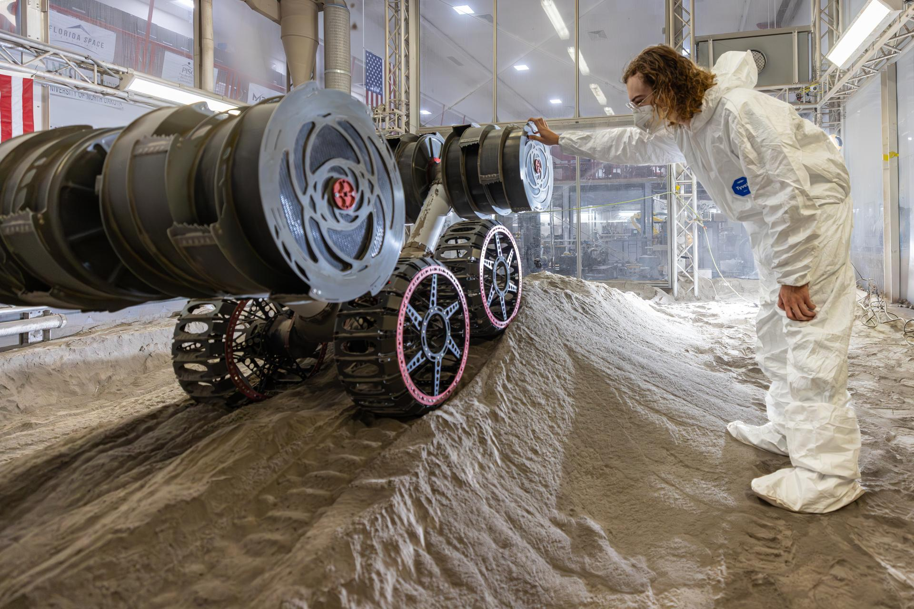
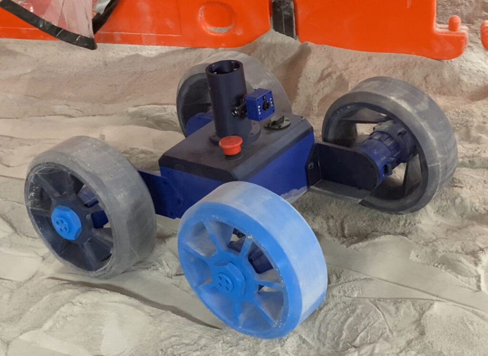
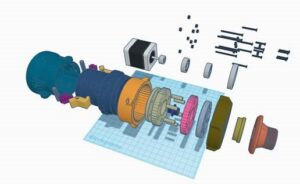

# RE-RASSOR-Lunar-Robot--Capstone-Project-
Electrical lead on a class project converting the RE-RASSOR Lunar Robot's stepper drivetrain to four independently driven, closed-loop BLDC motors. Designed the wiring map, selected motor controllers and encoders, and modeled/tuned the PID control system in MATLAB/Simulink and Simscape Electrical.

RE-RASSOR (Research & Education – Regolith Advanced Surface Systems Operations Robot) is a scaled-down, 3D-printable educational platform modeled after NASA Kennedy Space Center's RASSOR excavator. The original RASSOR is a teleoperated lunar/Martian mining robot that uses counter-rotating bucket drums on opposing arms to excavate regolith (surface soil) with near-zero net reaction force, letting it dig effectively even in the Moon's low-gravity environment where a vehicle's own weight can't provide enough traction for traditional excavation methods. RE-RASSOR brings that same four-wheeled, drum-excavator design down to an affordable, open-source platform that university teams can build, modify, and experiment with, making it a common senior-design and class-project base for students working on drivetrain, control systems, and autonomy challenges.

*Real model in Nasa Lab*

*3D printed version for University uses*

*CAD Exploded view of Drive Hub*

This exploded view lays out the wheel drivetrain assembly in build order, from the motor through to the wheel hub. On the left is the stepper motor (the original drive component this project is replacing), followed by a coupling/shaft interface, a housing or gear-reduction stage, a series of spacers, bearings, and a retaining disc, and finally the wheel hub itself on the right. The scattered fasteners (bolts, screws, and pins) shown separately above the assembly indicate the hardware needed to secure each stage together.

## More to come as project develops
